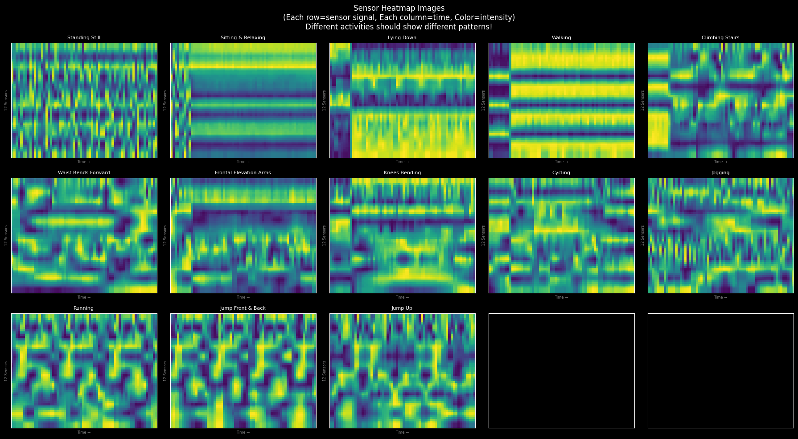
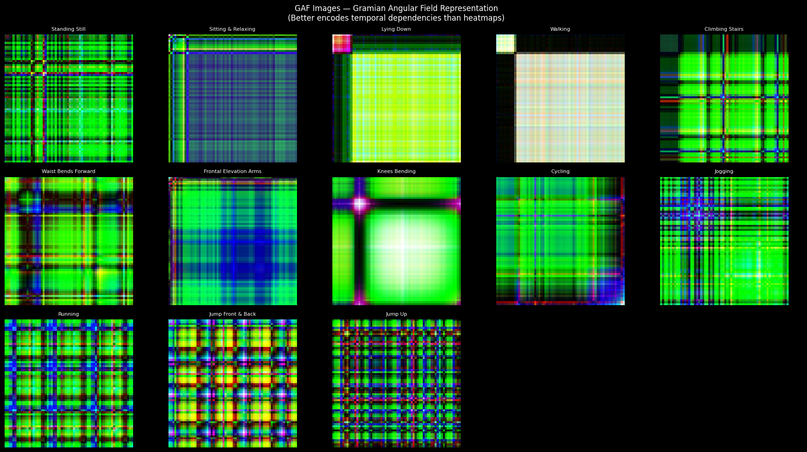
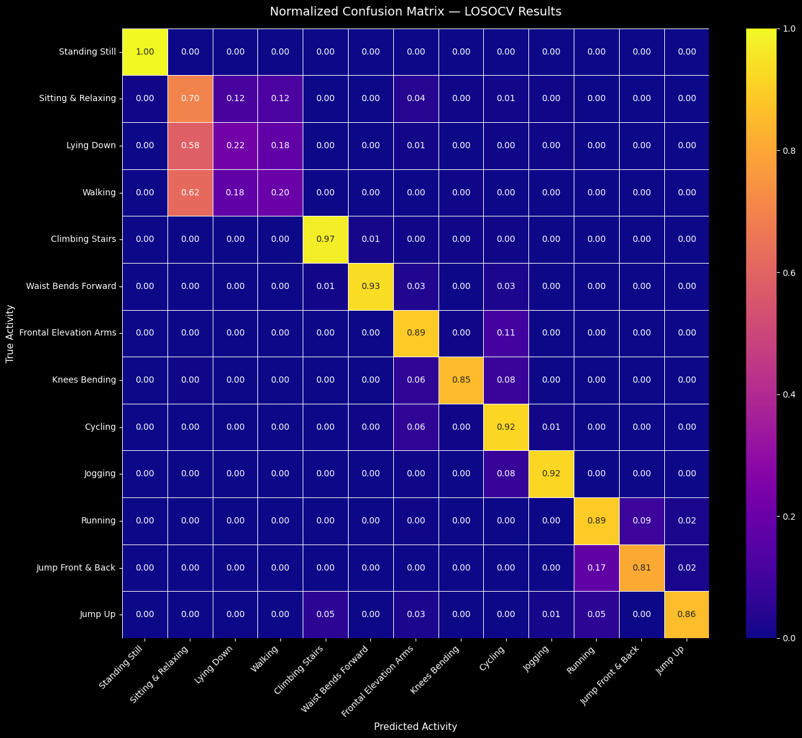
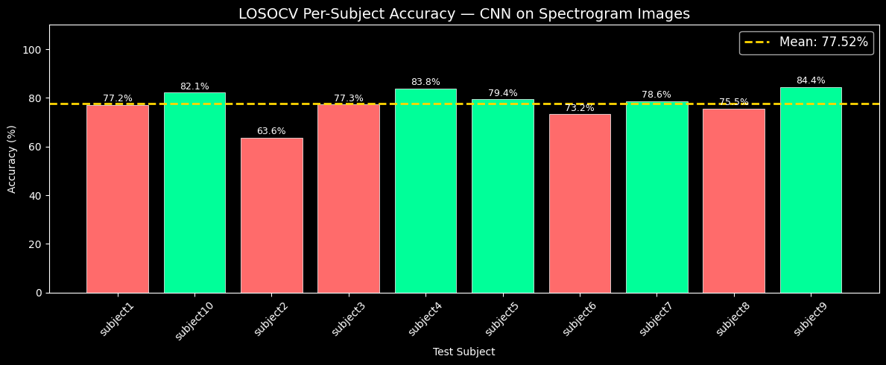

# 🏃 Human Activity Recognition with Wearable Sensors
### Deep Learning + Image Processing on MHEALTH Dataset

[](https://colab.research.google.com/github/bhargavi-46/HAR_wearable-sensors/blob/main/HAR_ImageProcessing_Complete.ipynb)


---

## 📌 Overview

This project tackles **Human Activity Recognition (HAR)** from wearable sensor data by transforming raw time-series signals into 2D images and applying deep learning classifiers. We explore two image encoding strategies — **Sensor Heatmaps** and **Gramian Angular Fields (GAF)** — evaluated rigorously under **Leave-One-Subject-Out Cross Validation (LOSOCV)** for subject-independent generalization.


---

## 🏆 Results

| Approach | Model | LOSOCV Accuracy | Std Dev | Best Fold | Worst Fold |
|---|---|---|---|---|---|
| Sensor Heatmap + CLAHE | CNN | **77.52%** | ±5.74% | 84.41% | 63.58% |
| Gramian Angular Field | CNN-LSTM | **74.46%** | ±8.13% | 82.37% | 57.99% |

---

## 🧠 Pipeline

```
Raw Sensor Data (MHEALTH)
         ↓
Sliding Window Segmentation (128 samples, 50% overlap)
         ↓
 ┌───────────────────────────────────────┐
 │  Approach 1: Sensor Heatmap           │
 │  Channel-wise norm → Viridis colormap │
 │  → 64×64 RGB image → CLAHE           │
 └──────────────────┬────────────────────┘
                    ↓
             CNN Classifier
             77.52% LOSOCV
 ┌───────────────────────────────────────┐
 │  Approach 2: Gramian Angular Field    │
 │  Temporal correlations encoded as     │
 │  angular cosine → 64×64 RGB image     │
 └──────────────────┬────────────────────┘
                    ↓
          CNN-LSTM Classifier
          74.46% LOSOCV
         ↓
  Activity Classification (13 classes)
```

---

## 📂 Repository Structure

```
HAR_wearable-sensors/
│
├── HAR_ImageProcessing_Complete.ipynb   # Main notebook (run on Colab with GPU)
├── README.md
│
├── images/                             +
│   ├── confusion_matrix_cnn.png
│   ├── heatmap_samples.png
│   ├── gaf_samples.png
│   ├── losocv_accuracy_plot.png
│   └── activity_distribution.png
│
└──                          
```

---

## 🖼️ Visualizations

### Sensor Heatmap Images (Approach 1)
> Each 128-sample sensor window is converted to a 64×64 RGB heatmap using the Viridis colormap, followed by CLAHE contrast enhancement.

<!-- Add your heatmap sample image here -->


---

### Gramian Angular Field Images (Approach 2)
> Temporal correlations in the sensor signal are encoded as angular cosine differences, producing a 3-channel 64×64 GAF image.

<!-- Add your GAF sample image here -->


---

### Confusion Matrix — CNN (Heatmap)
<!-- Add your CNN confusion matrix here -->


---

### GAF + CNN-LSTM LOSOCV Results
<!-- Add your CNN-LSTM confusion matrix here -->


---

### LOSOCV Accuracy per Fold
<!-- Add your per-fold accuracy bar chart here -->


---

## 📦 Dataset

**MHEALTH (Mobile Health)** — publicly available wearable sensor dataset.

| Property | Value |
|---|---|
| Subjects | 10 |
| Activities | 13 |
| Total Samples | 372,735 rows |
| Windowed Segments | 2,906 |
| Sensor Columns | `alx, aly, alz, glx, gly, glz, arx, ary, arz, grx, gry, grz` |

**Activity Classes:**
`Standing Still` · `Sitting & Relaxing` · `Lying Down` · `Walking` · `Climbing Stairs` · `Waist Bends Forward` · `Frontal Elevation Arms` · `Knees Bending` · `Cycling` · `Jogging` · `Running` · `Jump Front & Back` · `Jump Up`

> Dataset available at: [UCI MHEALTH Dataset](https://archive.ics.uci.edu/ml/datasets/MHEALTH+Dataset)

---

## 🛠️ Image Processing Techniques

### Approach 1 — Sensor Heatmap
1. **Sliding window segmentation** — 128 samples, 50% overlap
2. **Channel-wise min-max normalization** per sensor row
3. **Viridis colormap** applied → converted to 64×64 RGB image
4. **CLAHE enhancement** — `clipLimit=2.0`, `tileGridSize=8×8`

### Approach 2 — Gramian Angular Field (GAF)
1. **GAF transformation** using `pyts` — encodes temporal correlations as angular cosine differences
2. **3-channel RGB encoding** from multi-sensor GAF maps
3. **Gaussian noise augmentation** applied during training
4. Output: 64×64 RGB image

---

## 🧱 Model Architectures

### Model 1 — CNN (for Heatmap Images)
- 3 convolutional blocks: `Conv2D(32) → Conv2D(64) → Conv2D(128)`
- BatchNormalization + MaxPooling + Dropout after each block
- `GlobalAveragePooling2D` → `Dense(256)` → `Softmax(13)`
- **325,293 trainable parameters**

### Model 2 — CNN-LSTM (for GAF Images)
- Same 3-block CNN backbone for spatial feature extraction
- `TimeDistributed` wrapper → `LSTM(128)` for temporal modelling
- `Dense(64)` → `Softmax(13)`

**Training Config:** `Adam optimizer` · `categorical_crossentropy` · `EarlyStopping(patience=10)` · `ReduceLROnPlateau`

---

## 🔁 Evaluation Strategy

**LOSOCV (Leave-One-Subject-Out Cross Validation)**  
One subject is held out as the test set in each fold; the model trains on all remaining subjects. This ensures **subject-independent generalization** — the model is never evaluated on a subject it has seen during training.

- 10 folds (one per subject)
- Metrics reported: mean accuracy, standard deviation, per-fold accuracy

---

## 🚀 How to Run

1. Open the notebook in **Google Colab** (T4 GPU recommended)  
   → Click the **Open in Colab** badge at the top

2. Mount your Google Drive:
   ```python
   from google.colab import drive
   drive.mount('/content/drive')
   ```

3. Place the MHEALTH dataset CSV at:
   ```
   /content/drive/MyDrive/Datasets/mhealth_human_activity_data/mhealth_resampled_data.csv
   ```

4. Run all cells sequentially. Preprocessed images and trained models are **saved to Drive** so retraining is not needed on re-runs.

---

## 📋 Requirements

```
tensorflow >= 2.19
numpy
pandas
matplotlib
seaborn
opencv-python (cv2)
scikit-learn
scipy
pyts
```

Install with:
```bash
pip install tensorflow numpy pandas matplotlib seaborn opencv-python scikit-learn scipy pyts
```

---

## 📄 References

- Banos et al., *MHEALTH Dataset*, UCI ML Repository
- Gholamiangonabadi et al., *Deep Neural Networks for Human Activity Recognition with Wearable Sensors*, IEEE Access, 2020
- Wang et al., *Encoding Time Series as Images for Visual Inspection*, AAAI Workshop, 2015 *(GAF)*

---


---

*Made with ❤️ for the Image Processing Course, IIIT Vadodara–ICD*
